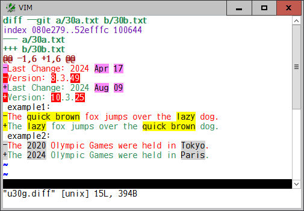
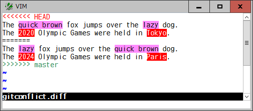

# diffunitsyntax

### Highlight word or character based diff units in diff format

This plugin is an additional vim syntax for diff format and highlights changed
and added diff units on word or character basis.

For example, a diff file in unified format will be shown like this:

This syntax plugin:
* identify either of unified, context, or normal "ed-style" diff format
* find corresponding changed lines to be compared
* split each line to a list of diff units based on the `g:DiffUnit` variable
* compare them and find the changed and added units using a builtin `diff()`
  function
* show those units in single or several syntax highlights based on the
  `g:DiffColors` variable

In addition to those diff formats, if the file extension is ".diff" or the
`syntax` option is set to "diff", this syntax plugin checks a file including
**git conflict markers** and shows the diff units like this:

#### Options

* `g:DiffUnit`, `b:DiffUnit`: A type of diff unit

  | Value | Description |
  | --- | --- |
  | 'Char' | any single character |
  | 'Word1' | `\w\+` word and any `\W` single character (default) |
  | 'Word2' | non-space and space words |
  | 'Word3' | `\<` or `\>` character class boundaries (set by `iskeyword` option) |
  | 'word' | see `word` |
  | 'WORD' | see `WORD` |

* `g:DiffColors`, `b:DiffColors`: Highlight group for changed units (`hl-DiffAdd` for added units)

  | Value | Description |
  | --- | --- |
  | 0 | `hl-DiffChange` |
  | 1 | `hl-DiffChange` + several highlight groups (default) |
