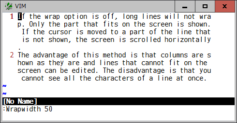
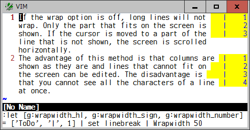

# difffilter

## Diff line filter

The standard "diff" command has "--ignore-matching-lines=regexp (-I regexp)"
option to ignore a hunk if all the inserted and deleted lines match regexp.
This plugin provides similar functionality but tries a line-level filtering
based on regexp and other matching criteria.

For example, vim will show such differences for these 3 files:



This plugin gets vim to exclude comment lines so that you can focus on the
"return" statement in 3 files.



Internally, this plugin sets a function to `diffexpr` option to:
* evaluate if each line is to-be-compared or not by using an expression set in
  a `DiffFilterExpr` tabpage-local or global variable.
* set a special symbol to excluded lines in 2 files
* call a builtin diff function to compare them
* modify diff hunks to handle to-be-compared lines in vim

You need to set a boolean expression in `t:DiffFilterExpr` or
`g:DiffFilterExpr` variable. In above example, the following lambda expression
is specified to exclude comment lines.
```
let g:DiffFilterExpr = {lnum -> getline(lnum) !~ '^\s*["#]'}
```
Alternatively, to exclude comment lines commonly for all filetypes, specify to
check a syntax highlighting on each line:
```
let g:DiffFilterExpr = {lnum -> synIDtrans(synID(lnum,
                      \match(getline(lnum), '\S') + 1, 0)) != hlID('Comment')}
```
To use the last selected Visual area:
```
let g:DiffFilterExpr = {lnum -> line("'<") <= lnum && lnum <= line("'>")}
```
To compare lines not including a multibyte character:
```
let g:DiffFilterExpr = {lnum -> getline(lnum) !~ '[^\x00-\x7F]'}
```
To select indented lines:
```
let g:DiffFilterExpr = {lnum -> 0 < indent(lnum)}
```
To exclude lines based on the number of fields criteria:
```
function MyDiffFilterExpr(lnum)
  let nfield = len(split(getline(a:lnum)))
  return 2 < nfield && nfield < 6
endfunction
let g:DiffFilterExpr = function('MyDiffFilterExpr')
```
As a default, this plugin sets `hl-Conceal` to visualize which line is not
diff compared and conceal them. To hide those lines, use `conceallevel` and
`concealcursor` options. Disable `t:DiffFilterConceal` or
`g:DiffFilterConceal` variable if not necessary,

Use `:diffupdate` command to reevaluate and redraw diff lines when something
is changed.

### Options

* `t:DiffFilterExpr`, `g:DiffFilterExpr`
  * An boolean expression to evaluate if a line is to-be-compared or not
    (default: {-> 1}).

* `t:DiffFilterConceal`, `g:DiffFilterConceal`
  * Enable (1) or disable (0) to highlight other lines than diff compared in
    `hl-Conceal` (default: 1).

* `g:NoDiffFilter`
  * Enable (0) or disable (1) this plugin (default: 0).

### Requirements

This plugin requires a builtin diff function:
* `diff()` and patch-9.1.0099 in vim 9.1
* Lua `vim.diff()` in nvim 0.6.0
