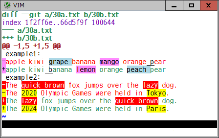

# diffunitsyntax

### Highlight word or character based diff units in diff format

This plugin is an additional vim syntax for diff format and highlights
changed/added/deleted diff units on word or character basis, to make it
possible to see the actual differences within a line.

For example, a diff file in unified format will be shown like this:

This syntax plugin does:
* identify either of unified, context, or normal "ed" style diff format, which
  can be provided by some program like **diff** and **git diff** commands
* find corresponding changed lines to be compared
* split each line to a list of diff units, based on the `DiffUnit`
  buffer-local or global variable
* compare them and find the changed/added/deleted units, using a builtin
  `diff()` function or a plugin specific function along with the `diffopt`
  option
* show those units in single or several background-colored syntax highlights,
  based on the `DiffColors` buffer-local or global variable

In addition to those standard diff formats, this syntax plugin identifies a
file including **git conflict markers** and **diff indicators (`-`/`+` and
`<`/`>`)**, and then shows the diff units.
 

git conflict markers

diff indicators

#### Diff syntax highlighting on plugins

When the `syntax` option is set to "diff", vim original diff syntax files are
loaded and the diff items are highlighted. However, to show `git diff` output
and to preview a diff hunk, some popular git-related plugins do not use the
diff syntax but use matchadd, text property, and extended mark functions in
normal, preview, and popup/floating windows. This syntax plugin provides an
option to apply the diff syntax and show actual inline differences, based on
the `ApplyDiffSyntax` global variable, on the following plugins:

vim-fugitive

[vim-fugitive](https://github.com/tpope/vim-fugitive) 

neogit

[neogit](https://github.com/NeogitOrg/neogit) 

vim-gin

[vim-gin](https://github.com/lambdalisue/vim-gin) 

gtsigns.nvim

[gitsigns.nvim](https://github.com/lewis6991/gitsigns.nvim) 

vim-gitgutter

[vim-gitgutter](https://github.com/airblade/vim-gitgutter) 

vim-signify

[vim-signify](https://github.com/mhinz/vim-signify) 

#### Options

* `b:DiffUnit`, `g:DiffUnit`: A type of diff unit

  | Value | Description |
  | --- | --- |
  | 'Char' | any single character |
  | 'Word1' | `\w\+` word and any `\W` single character (default) |
  | 'Word2' | non-space and space words |
  | 'Word3' | `\<` or `\>` character class boundaries (set by `iskeyword` option) |
  | 'word' | see `word` |
  | 'WORD' | see `WORD` |

* `b:DiffColors`, `g:DiffColors`: Highlight group for changed units (`hl-DiffAdd` for added units)

  | Value | Description |
  | --- | --- |
  | 0 | `hl-DiffChange` |
  | 1 | `hl-DiffChange` + several highlight groups (default) |

* `b:DiffUnitSyntax`, `g:DiffUnitSyntax` : Enable or disable this syntax plugin

  | Value | Description |
  | --- | --- |
  | 0 | disable |
  | 1 | enable (default) |

* `g:ApplyDiffSyntax` : Apply diff syntax on several git-related plugins

  | Value | Description |
  | --- | --- |
  | 0 | disable |
  | 1 | enable (default) |
